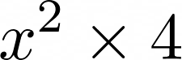
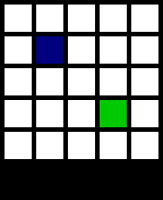
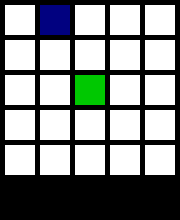
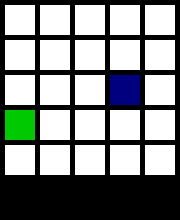
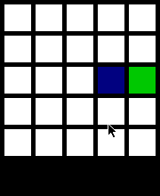

# Reinforcement Learning Grid Game

The game was built in order to easily (with the addition of new rows and columns) increase the number of states. In fact, if we consider *x* as the number of rows and columns, the number of states is , since the number of actions are 4 (i.e., up, right, down, left).

## Q-learning
The agent's performance given different number of iterations (each action is one iteration)
| 100000 | 250000 | 500000 | 1000000 |
| --- | --- | --- | --- |
|  |  |  |  | 
 
